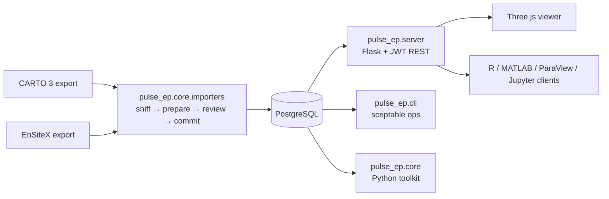

---
hide:
  - navigation
---

# pulse-ep

**An open-source platform for programmatic access to electroanatomical mapping data.**

`pulse-ep` parses **CARTO 3** (Biosense Webster / Johnson & Johnson) and **EnSiteX**
(Abbott / St. Jude) export archives into a relational PostgreSQL database — under one
vendor-neutral vocabulary — and exposes the data through four independent surfaces:

<div class="grid cards" markdown>

-   :material-api:{ .lg .middle } __REST API__

    ---

    A JWT-authenticated Flask service exposing studies, maps, meshes,
    scalar fields, and per-interval area reductions over JSON.

    [:octicons-arrow-right-24: REST API reference](reference/rest-api.md)

-   :material-cube-outline:{ .lg .middle } __3D Web Viewer__

    ---

    A browser-based Three.js / WebGL viewer for interactive
    inspection of chamber meshes and scalar fields — no install on
    the clinician's side.

    [:octicons-arrow-right-24: Viewer guide](guides/web-viewer.md)

-   :material-language-python:{ .lg .middle } __Python toolkit__

    ---

    `pulse_ep.core` — domain classes (`EPMap`, `Study`, `ScalarField`,
    `MeasurementPoint`), per-vendor decode, geodesic distances,
    surface-area integration, map comparison, ORM models.

    [:octicons-arrow-right-24: Python API](reference/python-api.md)

-   :material-console:{ .lg .middle } __CLI utilities__

    ---

    `pulse-ep-import-carto`, `pulse-ep-import-ensite`, `pulse-ep-server`,
    `pulse-ep-create-user`, `pulse-ep-demo`, … — scriptable operations.

    [:octicons-arrow-right-24: CLI reference](reference/cli.md)

-   :material-robot-outline:{ .lg .middle } __MCP server__

    ---

    Read-only access for an AI client over the Model Context Protocol.
    Study identity is anonymised by default, and a deployment can switch
    it off entirely.

    [:octicons-arrow-right-24: The MCP server](guides/mcp.md)
</div>

## Why pulse-ep?

Clinical mapping systems record ablation procedures as triangulated chamber
meshes with per-vertex activation times, bipolar voltages, and pace-mapping
similarity scores. They are excellent for real-time clinical decision-making
but provide **no programmatic interface** — quantitative research requires
external access to raw mesh geometry and measurement-point coordinates.

They also disagree with each other: the same physical quantity carries a
different name in every system. `pulse-ep` resolves that once, at import.
Every value is stored under **the name of the quantity it holds** —
`voltage_bipolar`, `activation_time` — so a single query spans a CARTO map
and an EnSiteX map alike.

From there, heterogeneous clients — Python and MATLAB scripts, R workflows,
Excel reports, the bundled web viewer, ParaView, or your own client — can
analyse the data on equal footing.

## Architecture at a glance



The bundled web viewer and the [`examples/`](examples/index.md) for R,
MATLAB, ParaView and Jupyter are all clients of the same REST API.
There is no privileged internal channel; what the viewer does, any
client can do.

## A 60-second taste

```bash
# Run a self-contained synthetic walkthrough — no database needed
git clone https://github.com/swillert/pulse-ep.git
cd pulse-ep && pip install -e "."
pulse-ep-demo
```

This builds an atrium-like ellipsoid, paints a Gaussian pace-mapping score
field onto it, wraps it as an `EPMap` and prints the mesh size, the score
distribution, the total surface area and the area per score interval. It
exercises the array-only public API and needs no database, which makes it the
smallest check that an installation is healthy — for first-time users and CI
smoke tests alike.

For real study data and the web viewer, see the [Quickstart](getting-started/quickstart.md).

## How to read this documentation

- **[Getting started](getting-started/installation.md)** — install, configure
  and run pulse-ep against either a synthetic dataset or your own export.
- **[Guides](guides/carto-import.md)** — task-oriented walkthroughs: importing
  a study, navigating the web viewer, deploying with Docker, managing users,
  building reports.
- **[Reference](reference/rest-api.md)** — exhaustive specification of the
  REST API, command-line tools, Python API (auto-generated from docstrings),
  database schema, and every `PULSE_EP_*` configuration variable.
- **[Examples](examples/index.md)** — runnable client code in R, MATLAB,
  ParaView and Jupyter. The same scalar histogram and the same area-per-interval
  table computed in four independent toolchains.
- **[Architecture](architecture.md)** — design rationale for contributors.

## Citation

If you use `pulse-ep` in academic work, please cite the archived release.
The DOI below is the *concept* DOI — it always resolves to the latest
version; use a release's own DOI to pin an exact one. Machine-readable
metadata is in
[`CITATION.cff`](https://github.com/swillert/pulse-ep/blob/main/CITATION.cff),
and the accompanying software paper is in preparation for *SoftwareX*.

```bibtex
@software{willert_pulse_ep,
  author  = {Willert, Sven and Lian, Evgeny and Frank, Derk},
  title   = {{pulse-ep: An open-source platform for programmatic access to multivendor electroanatomical mapping data}},
  year    = {2026},
  version = {0.2.0},
  doi     = {10.5281/zenodo.20263542},
  url     = {https://doi.org/10.5281/zenodo.20263542},
}
```

## License

`pulse-ep` is released under the [MIT License](https://github.com/swillert/pulse-ep/blob/main/LICENSE).
Use, modify, redistribute — within or outside academia — without restriction beyond attribution.
