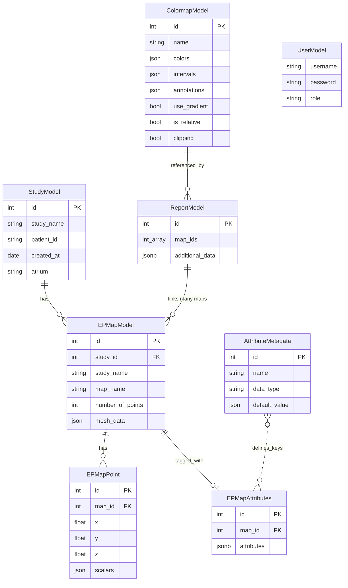

# Data model

`pulse-ep` persists CARTO studies in a relational PostgreSQL schema
defined by SQLAlchemy ORM classes in `pulse_ep.core.models`. This page
describes each table, the relationships between them, and the JSONB
columns where it matters.

## Schema overview

## Tables

### `StudyModel`

One row per CARTO study (i.e. one patient session). The primary
identifier is `(id, study_name)`; `study_name` is unique.

| Column        | Type    | Notes                                                |
| ------------- | ------- | ---------------------------------------------------- |
| `id`          | int     | Primary key.                                         |
| `study_name`  | text    | Unique. Sourced from `Study_*.xml` `Name` attribute. |
| `patient_id`  | text    | Anonymised patient identifier.                       |
| `created_at`  | date    | Study creation date.                                 |
| `atrium`      | text    | `LA` / `RA` / `Both` / unknown.                      |

The class exposes `get_study_list(session)` and
`get_epmap_list_by_id(session, study_id)` as the canonical read-side
helpers used by `/list_studies` and `/list_epmaps_in_study/<id>`.

### `EPMapModel`

One row per EP map. The mesh itself is stored as a JSON blob in
`mesh_data` (vertices + triangles) — this is a trade-off chosen for
simpler reads at the cost of denormalisation. Each row also has a
hot link back to `study_name` to avoid a join when listing maps.

| Column              | Type    | Notes                                              |
| ------------------- | ------- | -------------------------------------------------- |
| `id`                | int     | Primary key.                                       |
| `study_id`          | int     | FK to `StudyModel.id`.                             |
| `study_name`        | text    | Denormalised for read performance.                 |
| `map_name`          | text    | From `Map_*.xml` `Name` attribute.                 |
| `number_of_points`  | int     | Pre-computed for fast UI rendering.                |
| `mesh_data`         | json    | `{ "vertices": [...], "triangles": [...] }`.       |

`retrieve(session, map_id)` is the canonical loader.
`to_epmap(include_points=True)` constructs an in-memory [`EPMap`][pulse_ep.EPMap]
domain object suitable for mesh / area / geodesic computations.

### `EPMapPoint`

The catheter measurement points — one row per recorded position.
Coordinates and scalar values are kept separate because some maps have
thousands of points and we want fast bulk reads of just the coordinates.

| Column      | Type    | Notes                                              |
| ----------- | ------- | -------------------------------------------------- |
| `id`        | int     | Primary key.                                       |
| `map_id`    | int     | FK to `EPMapModel.id`.                             |
| `x` / `y` / `z` | float | Catheter position in mm.                          |
| `scalars`   | json    | `{ "act": …, "voltage": …, "similarity": …, … }`.  |

The full per-point record is exposed to clients via
`/get_mesh_data?map_id=…` in the `point_data` field.

### `EPMapAttributes`

Sparse tag store for per-map attributes — `pacemap` flag, `atrium`,
operator, free-form notes. Backed by a single JSONB column for
schema flexibility.

| Column        | Type   | Notes                                          |
| ------------- | ------ | ---------------------------------------------- |
| `id`          | int    | Primary key.                                   |
| `map_id`      | int    | FK to `EPMapModel.id`. Unique.                 |
| `attributes`  | jsonb  | `{"pacemap": true, "atrium": "LA", …}`.        |

The `@>` containment operator is used by
`/epmaps/filter_by_attributes` for cheap server-side filtering.

### `AttributeMetadata`

The schema for `EPMapAttributes.attributes` — the set of well-known
attribute keys with their types and defaults. Drives the
`/epmaps/distinct_attributes` endpoint and the viewer's attribute filter UI.

| Column          | Type   | Notes                                              |
| --------------- | ------ | -------------------------------------------------- |
| `id`            | int    | Primary key.                                       |
| `name`          | text   | Attribute name (e.g. `pacemap`).                   |
| `data_type`     | text   | `string` / `boolean` / `int` / `float`.            |
| `default_value` | json   | Default value when an `EPMapAttributes` row is absent. |

Seeded by `seed_attribute_metadata()` on first
`init_db()`. Custom attributes can be added at any time by inserting a
new row.

### `ColormapModel`

| Column        | Type   | Notes                                                  |
| ------------- | ------ | ------------------------------------------------------ |
| `id`          | int    | Primary key.                                           |
| `name`        | text   | Unique.                                                |
| `colors`      | json   | `["#3a76ff", "#ffd700", …]`.                           |
| `intervals`   | json   | `[50, 70, 85, 100]` — length = `len(colors) + 1`.       |
| `annotations` | json   | Optional human-readable label per interval.            |
| `use_gradient`| bool   | Smooth interpolation or hard steps.                    |
| `is_relative` | bool   | Bounds interpreted as % of per-map max if `true`.      |
| `clipping`    | bool   | Out-of-range values clipped if `true`, `NaN` otherwise. |

See [Colormaps and reports](../guides/colormaps-and-reports.md) for the
intended workflow.

### `ReportModel`

A saved per-map area-breakdown configuration plus the metadata of any
generated Excel sheet.

| Column           | Type        | Notes                                              |
| ---------------- | ----------- | -------------------------------------------------- |
| `id`             | int         | Primary key.                                       |
| `map_ids`        | int[]       | PostgreSQL array of `EPMapModel.id`.               |
| `additional_data`| jsonb       | `{report_name, colormap_id, datatype, distance, status, excel_file, error}`. |

The `status` key drives the polling pattern documented in
[Colormaps and reports → Reports](../guides/colormaps-and-reports.md#reports).

### `UserModel`

| Column      | Type   | Notes                                              |
| ----------- | ------ | -------------------------------------------------- |
| `id`        | int    | Primary key.                                       |
| `username`  | text   | Unique.                                            |
| `password`  | text   | bcrypt hash. Cost factor from `PULSE_EP_BCRYPT_LOG_ROUNDS`. |
| `role`      | text   | `admin` or `user`.                                 |

See [Managing users](../guides/managing-users.md).

## Schema migrations

`init_db()` creates the schema with `Base.metadata.create_all()`.
Schema evolution is **additive** — existing UKSH databases must continue
to run on every release without data loss.

For richer migrations (column type changes, renamings) the roadmap
includes Alembic; until then, any breaking schema change must be
called out in the [Changelog](../changelog.md).

## See also

- [REST API reference](rest-api.md) — endpoints that read/write these tables.
- [Python API reference](python-api.md) — `pulse_ep.core.models`
  auto-generated docs.
- [CARTO import guide](../guides/carto-import.md) — the workflow that
  populates these tables.
