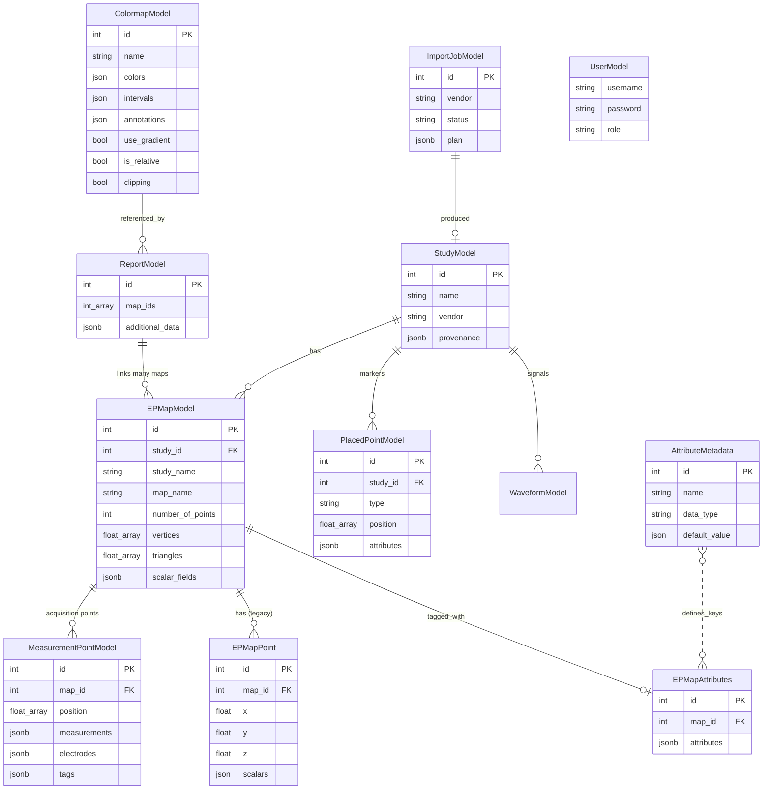

# Data model

`pulse-ep` persists CARTO studies in a relational PostgreSQL schema
defined by SQLAlchemy ORM classes in `pulse_ep.core.models`. This page
describes each table, the relationships between them, and the JSONB
columns where it matters.

## Schema overview



## Tables

### `StudyModel` — `studies`

One row per imported study, from either vendor. `name` is unique and is
what makes an import idempotent: re-importing a study already present is
skipped rather than duplicated.

| Column        | Type    | Notes                                                       |
| ------------- | ------- | ----------------------------------------------------------- |
| `id`          | int     | Primary key.                                                |
| `name`        | text    | Unique. CARTO: folder + study name; EnSiteX: the export GUID. |
| `vendor`      | text    | `carto` / `ensite` — which system produced the export.       |
| `provenance`  | jsonb   | Importer-supplied origin (software version, export GUID, …). |

The class exposes `get_study_list(session)` and
`get_epmap_list_by_id(session, study_id)` as the canonical read-side
helpers used by `/list_studies` and `/list_epmaps_in_study/<id>`.

### `EPMapModel`

One row per EP map. Geometry is stored as arrays rather than normalised
into vertex/triangle tables — a trade-off chosen for simpler reads. Each
row also carries `study_name` to avoid a join when listing maps.

| Column               | Type    | Notes                                                   |
| -------------------- | ------- | ------------------------------------------------------- |
| `id`                 | int     | Primary key.                                            |
| `study_id`           | int     | FK to `StudyModel.id`.                                  |
| `study_name`         | text    | Denormalised for read performance.                      |
| `map_name`           | text    | Map name as the acquisition system recorded it.         |
| `number_of_points`   | int     | Pre-computed for fast UI rendering.                     |
| `mesh_file`          | text    | Source mesh path, where one exists.                     |
| `vertices`           | float[] | Flat vertex coordinates.                                |
| `triangles`          | float[] | Triangle vertex indices, 0-based.                       |
| `triangle_areas`     | float[] | Pre-computed per-triangle areas.                        |
| `is_vertex_at_edge`  | float[] | Boundary flag per vertex.                               |
| `normals`            | float[] | Per-vertex normals.                                     |
| `act_bip`            | float[] | **Legacy** CARTO two-column slot; kept for figure/tag consumers. New code reads `scalar_fields`. |
| `uni_imp_frc`        | float[] | Legacy CARTO unipolar / impedance / force columns.      |
| `scalar_fields`      | jsonb   | The vendor-neutral per-vertex fields — see below.       |

#### `scalar_fields`

The heart of the vendor-neutral layer: a map from field name to a
serialised `ScalarField`. A field is **named by the quantity it holds**, so
one query spans both vendors.

```json
{
  "voltage_bipolar": {
    "values": [0.83, 0.85, ...],
    "kind": "voltage_bipolar",
    "unit": "mV",
    "status_mask": [true, false, ...],
    "source": "ensite/6.0.0.683129"
  }
}
```

`kind` comes from the controlled inventory in `pulse_ep.core.scalar_field`;
`status_mask` marks which vertices hold a real measurement rather than an
interpolated one; `source` records which vendor and software version
produced it.

`retrieve(session, map_id)` is the canonical loader.
`to_epmap(include_points=True)` constructs an in-memory [`EPMap`][pulse_ep.EPMap]
domain object suitable for mesh / area / geodesic computations.

### `MeasurementPointModel` — `measurement_points`

The acquisition points behind a map, with an **open** set of measurements
rather than fixed vendor columns. Successor to `EPMapPoint`, which it now
fully supersedes: everything the legacy table holds lives here, except
`connector_types` — derivable from the electrode labels — and only
`pulse-ep-import-carto` writes legacy rows at all (the queue and review-UI
path never has).

| Column          | Type    | Notes                                                          |
| --------------- | ------- | -------------------------------------------------------------- |
| `id`            | int     | Primary key.                                                   |
| `map_id`        | int     | FK to `epmaps.id`, `ON DELETE CASCADE`.                        |
| `point_index`   | int     | Order within the map.                                          |
| `source_id`     | text    | The vendor's own point id.                                     |
| `position`      | float[] | `[x, y, z]` on / near the surface.                             |
| `measurements`  | jsonb   | `{name: {value, kind, unit}}` — keyed by quantity, so a CARTO and an EnSiteX point are directly comparable. |
| `electrodes`    | jsonb   | `{label: [x, y, z]}` — catheter electrode geometry (`CS_1`, `20A_1`, …). |
| `tags`          | jsonb   | `[name, …]` — the vendor's markers on the point (`Location Only`, `Scar`, a study's own labels); what the point was meant for, not what it measured. |
| `annotations`   | jsonb   | `{start_time, reference, map, woi_from, woi_to}` — where the point's beat sits in the signal recorded for it: the window's first sample on the study clock, the reference and mapping annotations as offsets into it, and the window of interest. Acquisition bookkeeping, not a measured quantity, and the components `measurements` derives its activation time / pace-match score from. Keys an export does not carry are absent. |

### `PlacedPointModel` — `placed_points`

Operator- and system-placed markers: ablation sites, landmarks, labels.
Study-level, because a marker is a location in the shared study frame
rather than a property of one mesh.

| Column        | Type    | Notes                                                            |
| ------------- | ------- | ---------------------------------------------------------------- |
| `id`          | int     | Primary key.                                                     |
| `study_id`    | int     | FK to `studies.id`.                                              |
| `type`        | text    | `ablation`, `ablation_pfa`, `landmark`, `reference`, `marker`, `tag`, `shadow`, `tape_measure`. |
| `position`    | float[] | `[x, y, z]`.                                                     |
| `label`       | text    | Operator-visible name, where one exists.                         |
| `attributes`  | jsonb   | Open, type-specific: RF duration, force, impedance drop, …       |
| `source_id`   | text    | The vendor's own marker id.                                      |

### `WaveformModel` — `waveforms`

Signal traces are **opt-in** and stored outside the database — the row is
a reference, the samples live in Parquet.

| Column         | Type   | Notes                                                    |
| -------------- | ------ | -------------------------------------------------------- |
| `id`           | int    | Primary key.                                             |
| `study_id`     | int    | Owning study.                                            |
| `map_id`       | int    | Owning map, where the trace belongs to one.              |
| `point_source_id` | text | The acquired point this row is the signal for, where signals are per point (CARTO). `NULL` for per-segment exports (EnSiteX). Several rows can share one `data_uri`: a multi-electrode catheter takes many points from one recording. |
| `signal_type`  | text   | ECG, bipolar, unipolar, …                                |
| `channels`     | jsonb  | Channel labels, in column order.                         |
| `sample_rate`  | float  | Hz.                                                      |
| `n_samples` / `n_channels` | int | Shape, so a client can size a read without opening the file. |
| `segment`      | text   | Which export segment it came from.                       |
| `filters`      | jsonb  | Filter settings recorded by the acquisition system.      |
| `data_uri`     | text   | Where the samples live (store-relative).                 |
| `data_format`  | text   | `parquet`.                                               |
| `size_bytes` / `checksum` | int / text | Integrity and retention bookkeeping.        |
| `source`       | text   | Vendor and software version.                             |

### `ImportJobModel` — `import_jobs`

One queued import moving through the review lifecycle.

| Column         | Type      | Notes                                                       |
| -------------- | --------- | ----------------------------------------------------------- |
| `id`           | int       | Primary key.                                                |
| `source_path`  | text      | The export folder or archive.                               |
| `vendor`       | text      | Auto-detected; `NULL` when detection failed.                |
| `status`       | text      | `detected` → `needs_review` → `importing` → `done` \| `error`. |
| `plan`         | jsonb     | The `ImportPlan`, including the reviewer's edits.           |
| `study_id`     | int       | The study it produced — or the existing one it matched.     |
| `error`        | text      | Why it failed, when it did.                                 |
| `created_at` / `updated_at` | timestamptz | Set by the database.                         |

### `EPMapPoint` — `ep_map_points` (legacy)


The catheter measurement points — one row per recorded position.
Coordinates and scalar values are kept separate because some maps have
thousands of points and we want fast bulk reads of just the coordinates.

| Column      | Type    | Notes                                              |
| ----------- | ------- | -------------------------------------------------- |
| `id`        | int     | Primary key.                                       |
| `map_id`    | int     | FK to `EPMapModel.id`.                             |
| `x` / `y` / `z` | float | Catheter position in mm.                          |
| `scalars`   | json    | `{ "act": …, "voltage": …, "similarity": …, … }`.  |

The full per-point record is exposed to clients via
`/get_mesh_data?map_id=…` in the `point_data` field.

### `EPMapAttributes`

Sparse tag store for per-map attributes — `pacemap` flag, `atrium`,
operator, free-form notes. Backed by a single JSONB column for
schema flexibility.

| Column        | Type   | Notes                                          |
| ------------- | ------ | ---------------------------------------------- |
| `id`          | int    | Primary key.                                   |
| `map_id`      | int    | FK to `EPMapModel.id`. Unique.                 |
| `attributes`  | jsonb  | `{"pacemap": true, "atrium": "LA", …}`.        |

The `@>` containment operator is used by
`/epmaps/filter_by_attributes` for cheap server-side filtering.

### `AttributeMetadata`

The schema for `EPMapAttributes.attributes` — the set of well-known
attribute keys with their types and defaults. Drives the
`/epmaps/distinct_attributes` endpoint and the viewer's attribute filter UI.

| Column          | Type   | Notes                                              |
| --------------- | ------ | -------------------------------------------------- |
| `id`            | int    | Primary key.                                       |
| `name`          | text   | Attribute name (e.g. `pacemap`).                   |
| `data_type`     | text   | `string` / `boolean` / `int` / `float`.            |
| `default_value` | json   | Default value when an `EPMapAttributes` row is absent. |

Seeded by `seed_attribute_metadata()` on first
`init_db()`. Custom attributes can be added at any time by inserting a
new row.

### `ColormapModel`

| Column        | Type   | Notes                                                  |
| ------------- | ------ | ------------------------------------------------------ |
| `id`          | int    | Primary key.                                           |
| `name`        | text   | Unique.                                                |
| `colors`      | json   | `["#3a76ff", "#ffd700", …]`.                           |
| `intervals`   | json   | `[50, 70, 85, 100]` — length = `len(colors) + 1`.       |
| `annotations` | json   | Optional human-readable label per interval.            |
| `use_gradient`| bool   | Smooth interpolation or hard steps.                    |
| `is_relative` | bool   | Bounds interpreted as % of per-map max if `true`.      |
| `clipping`    | bool   | Out-of-range values clipped if `true`, `NaN` otherwise. |

See [Colormaps and reports](../guides/colormaps-and-reports.md) for the
intended workflow.

### `ReportModel`

A saved per-map area-breakdown configuration plus the metadata of any
generated Excel sheet.

| Column           | Type        | Notes                                              |
| ---------------- | ----------- | -------------------------------------------------- |
| `id`             | int         | Primary key.                                       |
| `map_ids`        | int[]       | PostgreSQL array of `EPMapModel.id`.               |
| `additional_data`| jsonb       | `{report_name, colormap_id, datatype, distance, status, excel_file, error}`. |

The `status` key drives the polling pattern documented in
[Colormaps and reports → Reports](../guides/colormaps-and-reports.md#reports).

### `UserModel`

| Column      | Type   | Notes                                              |
| ----------- | ------ | -------------------------------------------------- |
| `id`        | int    | Primary key.                                       |
| `username`  | text   | Unique.                                            |
| `password`  | text   | bcrypt hash. Cost factor from `PULSE_EP_BCRYPT_LOG_ROUNDS`. |
| `role`      | text   | `admin` or `user`.                                 |

See [Managing users](../guides/managing-users.md).

## Schema migrations

Schema evolution is **additive** — an existing database must continue to
run on every release without data loss.

Two paths exist, and they are not interchangeable:

- `init_db()` runs `Base.metadata.create_all()` at server startup. It
  creates *missing* tables and is what makes a fresh database usable; it
  never alters an existing one.
- `pulse-ep-migrate` applies the migrations, which ship inside the package
  (`pulse_ep/migrations/versions/`) so an installed deployment can upgrade
  too; `alembic upgrade head` does the same from a source checkout.
  This is what brings an existing database in step with a new release, and
  is the step to run after upgrading.

Alembic reads `PULSE_EP_DATABASE_URL` through `Settings`, so it needs no
configuration of its own. Any breaking schema change must additionally be
called out in the [Changelog](../changelog.md).

## See also

- [REST API reference](rest-api.md) — endpoints that read/write these tables.
- [Python API reference](python-api.md) — `pulse_ep.core.models`
  auto-generated docs.
- [CARTO import guide](../guides/carto-import.md) and
  [EnSiteX import guide](../guides/ensite-import.md) — the workflows that
  populate these tables.
